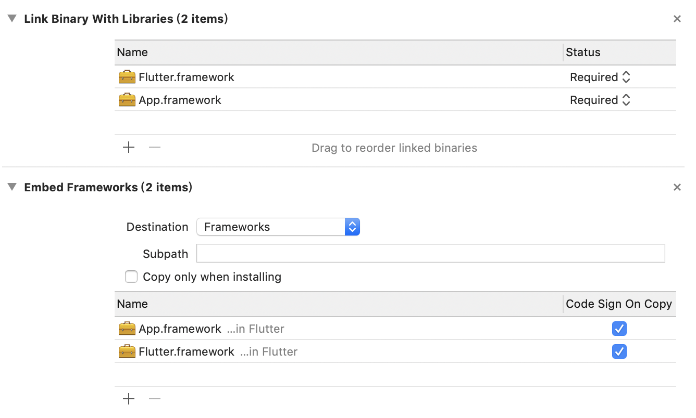

# IOSMixedFlutter
> Demo介绍了iOS集成Flutter模块，互相通讯，多环境配置，注意的地方。
> 关于集成的教程很多，这里就不一一赘述，这里记录下碰到的问题

#### 1、加载Flutter页面失败，报错 
`Could not launch engine with configuration.`

```
1. flutter clean
2. Go to Xcode > Product > Clean
3. flutter build ios
4. Open Runner in Xcode
5. Run Project to Make Sure it works
```

#### 2、Flutter 修改了配置文件，无法加载最新资源

```
flutter build ios

有时候模拟器无法加载，连接用真机尝试下
```

#### 3、iOS项目Archive打包失败
`Code signing “Flutter.framework” failed`


检查下iOS项目配置，Build Phases应该如下配置



之前报错是没有添加Embed Frameworks导致的，添加问题解决

#### 4、关于优化配置

检查下iOS项目配置，Build Phases应该如下配置


这脚本意思是针对flutter模块进行瘦身优化，官方脚本，待研究…

#### 5、关于多环境配置的想法

既然是iOS项目集成Flutter，Flutter模块的环境配置自然要和iOS模块同步，本示例中演示了一个笨拙的办法，通过iOS项目切换Scheme，通过`FlutterMethodChannel`交互通道，向flutter传递环境信息，flutter通过`AppConfig`模块，接收环境信息，设置相关配置，达到环境统一的效果。

思考：我这里实现的方法有点不高级，有没有切换Scheme同步切换Flutter环境的方法，比如flutter读取xcconfig配置参数等，希望了解的朋友能指点我下，这个模块待优化。

#### 6、pod设置没效果

```
flutter_application_path = '../flutter_module'
eval(File.read(File.join(flutter_application_path, '.ios', 'Flutter', 'podhelper.rb')), binding)
```

该设置pod install之后没任何效果，不知道原因，那就手动搞吧，找到flutter_module模块下的Flutter.framework和App.framework拖到项目中，记住要用引用的方式，不要拷贝，因为每次Flutter编译生成新的App.framework，这里得实时更新才行，不然看不到最新效果。如果看不到最新效果，则同第二个问题一样`flutter build ios`即可。

#### 先记录到这里，后面碰到问题再同步更新。。。


